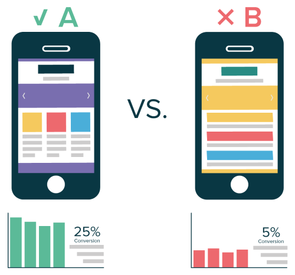

+++
title = "Intro to A/B Testing"
description = "What is A/B Testing?"
tags = ['A/B Testing', 'hypothesis testing']
date = "2021-01-21"
draft = true
+++

## What is A/B Testing?

A common example of A/B testing is a business making changes to its website with two versions. One version of the website let's call A, the other version let's call B. The two versions may be almost identical, but ith some key changes such as changing the wording of the website, or the placement of a button. Then we measure responses from visitors who visit either of the websites to see which version performs better, using some success metric such as clickthrough rate. 

As a randomized control experiment, A/B testing is a formal method for testing hypotheses. The findings are used for making decisions to estimate certain parameters of the population (e.g. all website visitors) based on sample statistics (e.g. website visitors who participated in the experiment).

Goal: Find out which website version increases the clickthrough rate (our success metric). A/B testing will be the method used to gather data and analyze which version performs better.

## Introduction to Hypothesis Testing (Statistics)

A hypothesis is an educated guess about certain phenomena that has yet to be verified. A hypothesis is testable by an experiment or by an observation of some process. 

In statistical hypothesis testing, a hypothesis should include both independent variables and dependent variables. An independent variable's value doesn't depend on other variable's values. A dependent variable reflect the effect of the independent variables. Sometimes we call the independent variables $x$, and the dependent variables $y$. The goal is to investigate the cause-and-effect relationship between $x$ and $y$.

An example of a hypothesis statement structure is the "If...x..., then...y".

For instance, "If we change the wording of the website button from 'Buy Now' to 'Add to Cart', it will increase the clickthrough rate." In other words, the button text is the independent variable, and the clickthrough rate is the dependent variable.

## A/B Testing detailed

## Use cases, applications

## Examples

## Further reading